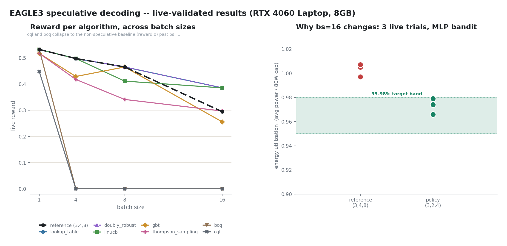
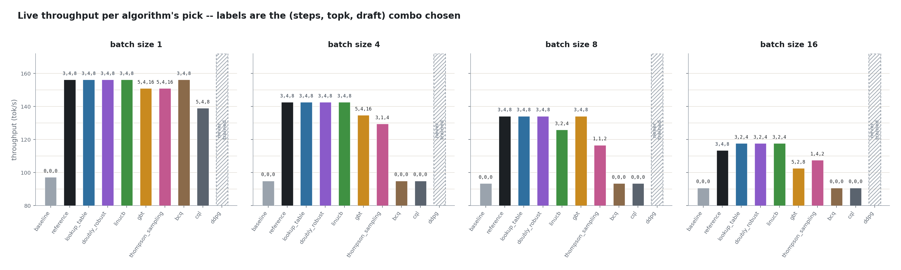

# Energy-Aware Speculative Decoding Control

A cookbook, not a paper. The deliverable is a small table of
`(speculative_num_steps, speculative_eagle_topk, speculative_num_draft_tokens)`
values per batch size that are known-good for EAGLE3 + sglang on this GPU, so
the params don't get guessed by hand every time a server spins up. The sweep,
the reward, and the eight algorithms below all exist to earn that table.

Target: hold GPU energy utilization (avg power / power limit) inside a tight
**95-98% band**. Below it there's idle capacity worth spending on deeper
speculation; above it the card is near its power cap, clocks down, and more
speculation just costs energy for nothing.

[](https://huggingface.co/datasets/Pradheep1647/eagle3-speculative-decoding-energy-sweep)
[](https://huggingface.co/Pradheep1647/eagle3-speculative-decoding-policy)

## The recipe

Live-measured on an RTX 4060 Laptop GPU (8GB), `unsloth/Llama-3.2-1B-Instruct`
+ `rescommons/SpecForge-EAGLE3-Llama-3.2-1B-Instruct` draft head, 80W cap:

| batch_size | steps | topk | draft | live reward | vs fixed `(3,4,8)` reference |
|---|---|---|---|---|---|
| 1  | 3 | 4 | 8 | 0.5323 | same config |
| 4  | 3 | 4 | 8 | 0.4975 | same config |
| 8  | 3 | 4 | 8 | 0.4653 | same config |
| 16 | 3 | 2 | 4 | 0.3855 | **+0.091**, avoids overshooting the band |

`bs=16` is the only case worth changing the launch flags for -- and four
independent methods (MLP bandit, lookup table, LinUCB, doubly robust) all
converge on the same `(3,2,4)` pick.

## Model I/O

**Input** -- 4-dim state, read from GPU telemetry after a config runs (not a
live pre-decision sensor read, see caveat below):

```
[ batch_size / 8.0, gpu_temp_c_before / 100.0, gpu_mem_used_mb / 8192.0, gpu_util_pct / 100.0 ]
```

**Output** -- an index into a fixed `ActionSpace` (`RL/policy.py`), decoded to
`--speculative-num-steps`, `--speculative-eagle-topk`,
`--speculative-num-draft-tokens`.

Grid before filtering: `steps ∈ {0,1,3,5} × topk ∈ {0,1,2,4} × draft ∈
{0,2,4,8,16}`, across `batch_size ∈ {1,4,8,16}` (batch size is a state
feature, not part of the action). Validity constraints, from sglang 0.5.2
source:

1. `steps * topk + 1 >= num_draft_tokens` -- surplus draft tokens can never
   be filled.
2. `topk == 1` forces `num_draft_tokens = steps + 1` server-side, collapsing
   two nominal configs into one.
3. `(0, 0, 0)` is the non-speculative baseline; any other zero-containing
   combo is invalid.

After validity + dedup: **19 distinct actions**.

Caveat: `gpu_mem_used_mb` / `gpu_util_pct` come from `metrics_after`, i.e.
*after* that config already ran, not a genuine pre-decision read. Fine for
picking a static per-batch-size config (everything here); would need fixing
before trusting live mid-session reactions.

## The sweep

`RL/run_sweep.py` launches a real sglang server per `(batch_size, config)` on
the physical GPU. The sweep runs once, caches to JSONL, and every algorithm
below trains against that cache, free, on CPU.

Per config: launch sglang (target + draft both forced to `dtype=float16`,
since EAGLE3's draft head ships fp16 and the target ships bf16 -- a mismatch
kills CUDA graph capture) → poll `/health` → warmup batch → snapshot energy
(`nvmlDeviceGetTotalEnergyConsumption`) and telemetry → fire
`max(num_prompts, batch_size)` requests at concurrency = batch_size against 4
fixed prompts, 512 output tokens each (same methodology as sglang's own
`bench_speculative.py`) → snapshot again, read `/get_server_info` for
`avg_spec_accept_length` and `step_time_dict` → `speed_tok_s =
accept_length / p20(step_time)` → tear down, sleep 5s to let the GPU settle.

Reward (`RL/reward.py`), computed offline from the cached row:

- `energy_utilization = avg_power_watts / power_limit_watts` (80W cap)
- `band_score`: 1.0 inside `[0.95, 0.98]`, linear ramp below, 10x-slope falloff above
- `throughput_score = clip((speed / baseline_speed - 1) / 2, 0, 1)` -- a
  config scored against itself is always exactly 0 here, by construction
- `reward = (band_score^w * throughput_score^(1-w)) * thermal_multiplier`
  (geometric mean, `w=0.5`), then a penalty for `>75°C` (0.8x), `>80°C`
  (0.5x), or active throttling (0.3x). Clipped to `[0, 1]`.

**Dataset**: 228 rows, 3 repeats of the 76-cell grid (4 batch sizes x 19
actions), landing at different thermal states per repeat. One config
(`bs=16, steps=5, topk=4, draft=16`) never fits in 8GB and is left as an
error row. Full details and schema on the [dataset card](https://huggingface.co/datasets/Pradheep1647/eagle3-speculative-decoding-energy-sweep).

## Results



### DDPG -- never produced a policy to validate

The original design (`RL/rl.py`): a Fast Actor emitting three sigmoid-scaled
continuous scalars, `torch.round`ed into the three integers, a Target Actor
for soft-update stability, a Q-Critic on `[state, action]`. No live
validation table -- there was never a trained policy:

| algorithm | bs=1 | bs=4 | bs=8 | bs=16 | avg reward | status |
|---|---|---|---|---|---|---|
| ddpg | -- | -- | -- | -- | -- | never trained |

Two independent, structural reasons:

1. `round()` has zero gradient almost everywhere -- backprop through the
   actor produced `grad: tensor([[0.]])`, so it never updated.
2. `profiler(eagle_3_sd)(...)` discarded its return value, so the reward it
   trained against was a hardcoded constant `0.9396` regardless of action.

Separately, only 75.4% of the continuous box (`steps ∈ [1,32] × topk ∈
[1,10] × draft ∈ [1,64]`) satisfies sglang's own validity constraints.
`RL/rl.py` is kept as a reference for what didn't work, not run for results.

### MLP contextual bandit -- current design, live A/B validated

Enumerates the legal triples into the 19-action `ActionSpace`, trains a
`QNetwork` for one Q-value per action, masks illegal actions to `-inf`,
picks greedily. One-step contextual bandit (`gamma=0`) -- the sweep captures
no state transition, so there's nothing for a discount factor to do.

Validated live 4 times: once with the trained policy, three more retrained
from scratch with a different seed each time. All converged on
`(steps=3, topk=2, draft=4)` at `bs=16`, the only bs where it diverges from
the reference:

| seed | ref reward | policy reward | delta |
|---|---|---|---|
| 0 | 0.3268 | 0.3869 | +0.0601 |
| 1 | 0.3181 | 0.3863 | +0.0682 |
| 2 | 0.0911 | 0.3852 | +0.2941 |
| 3 | 0.2978 | 0.4009 | +0.1032 |

reference: mean **0.2585**, std **0.097**  |  policy: mean **0.3898**, std
**0.0064**  |  mean delta **+0.131**

Visible directly in telemetry: the reference config's energy utilization sat
at **0.997, 1.005, 1.007** across the three seed trials -- consistently over
the band, worsening as the GPU heated up. The policy's pick landed at
**0.966, 0.974, 0.979** every time -- inside the band, higher reward on
average *and* 15x more stable.

### Seven alternative algorithms -- live validated, one paired trial

`RL/algos/` builds and live-validates every other algorithm applicable to
this problem shape (small discrete action space, one reward per pull, no
captured state transition). Same live A/B methodology, baseline and
reference re-measured fresh per batch size:

| algorithm | bs=1 | bs=4 | bs=8 | bs=16 | avg reward | vs reference |
|---|---|---|---|---|---|---|
| *(reference, fixed)* | 0.5323 | 0.4975 | 0.4653 | 0.2945 | 0.4474 | -- |
| lookup_table | 0.5323 | 0.4975 | 0.4653 | 0.3855 | **0.4702** | **+0.0228** |
| doubly_robust | 0.5323 | 0.4975 | 0.4653 | 0.3855 | **0.4702** | **+0.0228** |
| linucb | 0.5323 | 0.4975 | 0.4113 | 0.3855 | 0.4567 | +0.0093 |
| gbt | 0.5173 | 0.4290 | 0.4653 | 0.2555 | 0.4168 | -0.0307 |
| thompson_sampling | 0.5173 | 0.4177 | 0.3413 | 0.2971 | 0.3934 | -0.0541 |
| bcq | 0.5323 | 0.0000 | 0.0000 | 0.0000 | 0.1331 | -0.3143 |
| cql | 0.4483 | 0.0000 | 0.0000 | 0.0000 | 0.1121 | -0.3353 |



At `bs=16`, `(3,2,4)` isn't just the better energy-band pick -- it's also
**faster** than the reference (117.8 vs 113.4 tok/s), since the reference
overshoots into thermal throttling under sustained load at that batch size.

- **lookup_table, doubly_robust, and linucb all independently rediscover the
  MLP bandit's exact `bs=16` pick**, `(3,2,4)`, at a fraction of the training
  cost -- strong evidence it's a real property of the data.
- **cql and bcq collapsed onto the trivial non-speculative baseline
  `(0,0,0)`** at `bs=4,8,16` (reward 0 by construction, not measurement).
  Root cause is default hyperparameters far too conservative for this
  reward scale (CQL's `alpha=1.0`, BCQ's `threshold=0.3`), not a bug.
  Reported as-is rather than retuned.
- Discrete SAC/DQN weren't run -- they only make sense once configs switch
  *mid-session* against evolving thermal state (`gamma != 0`), which needs a
  genuinely different data collection pass: a live session hot-swapping
  speculative params and logging real `(state, action, reward, next_state)`
  transitions instead of independent rows.

**Saved models**, one file per algorithm, all in the [models repo](https://huggingface.co/Pradheep1647/eagle3-speculative-decoding-policy):

| algorithm | file |
|---|---|
| mlp_bandit | `mlp_bandit/policy.pth` |
| lookup_table | `lookup_table/model.json` |
| linucb | `linucb/model.npz` |
| thompson_sampling | `thompson_sampling/model.npz` |
| gbt | `gbt/model.joblib` |
| doubly_robust | `doubly_robust/model.joblib` |
| cql | `cql/policy.pth` |
| bcq | `bcq/policy.pth` |

Raw per-config live results: `RL/algos/results/live_validate.jsonl` /
`live_validate.log`. Per-algorithm picks: `RL/algos/results/picks.json`.

## Quality check -- does speculative decoding cost accuracy?

Live-measured on the same GPU: 8-shot CoT GSM8K, pass@8 (50 questions x 8
samples/question at temperature=0.7/top_p=0.95), and IFEval (150 prompts,
greedy), chat template applied, `lm_eval`'s `sglang-generate` backend
hitting a real sglang server per config (`RL/quality_benchmark.py`):

| config | steps/topk/draft | gsm8k pass@8 | ifeval prompt-strict | ifeval inst-strict | speed_tok_s | avg power | energy |
|---|---|---|---|---|---|---|---|
| no_spec | 0/0/0 | 0.76 | 0.40 | 0.5546 | 84.9 | 65.5W | 6188J |
| chosen, bs 1/4/8 | 3/4/8 | 0.76 | 0.40 | 0.5546 | 100.7 | 67.7W | 6450J |
| chosen, bs 16 | 3/2/4 | 0.78 | 0.40 | 0.5504 | 103.9 | 65.1W | 5947J |

Quality is unchanged (identical or within sampling noise) at both chosen
configs relative to `no_spec`, while throughput improves ~19-22%.

## Two bugs invalidated the first agentic pilots

The three agentic pilots below (Terminal-Bench, SWE-bench Lite, τ²-bench)
were first run with two defects that both suppressed speculative
decoding, and the original conclusion -- "spec decoding doesn't help on
agentic workloads" -- was an artifact of them, not a finding. Both are
fixed; every "after" number on this page is from a re-run on the same
GPU.

### Bug 1: RoPE mismatch between draft and target (the big one)

sglang's `LlamaDecoderLayer` builds rotary embeddings from **the draft
model's own `config.json`**, not the target's. The upstream SpecForge
draft head ships:

```
rope_theta        10000.0        # target: 500000.0
rope_scaling      null           # target: llama3, factor 32
```

So the draft head applied a completely different positional encoding
than the target it was supposed to predict for. Its proposals decorrelate
from the target's distribution as soon as position matters, the verifier
rejects nearly all of them, and `avg_spec_accept_length` collapses toward
1.0 -- which is exactly "spec decoding is on but doing nothing", plus the
draft-forward overhead. Fixed by copying the target's `rope_theta` and
`rope_scaling` into the draft config (weights untouched, no retraining):

| | `rope_theta` | `rope_scaling` |
|---|---|---|
| target `Llama-3.2-1B-Instruct` | 500000.0 | llama3, factor 32 |
| draft as published | 10000.0 | `null` |
| draft after patch | 500000.0 | llama3, factor 32 |

Effect on accept length, same tasks, same GPU:

| pilot | config | accept len before | accept len after |
|---|---|---|---|
| SWE-bench Lite | chosen (3/4/8) | ~1.0 | **2.26** |
| SWE-bench Lite | chosen_bs16 (3/2/4) | ~1.0 | **2.16** |
| τ²-bench | chosen (3/4/8) | 1.14 | **2.80** |
| τ²-bench | chosen_bs16 (3/2/4) | 1.10 | **2.56** |

Reported upstream as SpecForge issue #249. Note the fixed-length quality
benchmark above was *also* run on the unpatched draft -- its ~19-22%
speedup is a floor, not a ceiling.

### Bug 2: Harbor's 1M-token context fallback (Terminal-Bench only)

`harbor/llms/lite_llm.py`'s `get_model_context_limit()` falls back to
`fallback_context_limit = 1_000_000` for any model LiteLLM doesn't
recognize -- which includes every local OpenAI-compatible server. Terminus 2
sized its compaction against 1M tokens, so it never compacted, and prompts
ran straight past sglang's `max_req_input_len` of 57,760. The previous run
logged **315 server-side truncations**, with prompts reaching 81,947 tokens;
the agent was being fed silently mangled context for most of the run.

Fixed by passing Harbor the model metadata it asks for (its documented
approach for local servers, not a workaround) in
`RL/terminalbench_pilot.py`:

```python
MODEL_INFO = {
    "max_input_tokens": 57760,
    "max_output_tokens": 4096,
    "input_cost_per_token": 0.0,
    "output_cost_per_token": 0.0,
}
# ...
"--ak", f"model_info={json.dumps(MODEL_INFO)}",
```

Re-run: 0 fallback-context warnings, **0 truncations**.

## Agentic tool-use tasks -- does speculative decoding still help? (Terminal-Bench pilot)

The quality check above uses fixed-length text generation. Agentic,
multi-turn tool-use tasks are a different workload -- short, varied
completions interleaved with tool output the model didn't write -- so
they were checked separately with a small pilot on
[Terminal-Bench 2.0](https://www.tbench.ai/) via the
[Harbor](https://github.com/laude-institute/harbor) framework. Same GPU,
same `unsloth/Llama-3.2-1B-Instruct` + EAGLE3 draft pair, Terminus 2 as
the reference agent talking to the local sglang server. 2 tasks from
`terminal-bench-sample@2.0` (`regex-log`, `log-summary-date-ranges`) x 3
configs (`no_spec`, `chosen`, `chosen_bs16`), 1 trial each, Harbor's
900s-per-trial agent timeout in force.

`tok/s` here is Harbor's wall-clock aggregate (output tokens / trial
duration), so it includes Docker tool execution and agent-side parsing --
it is *not* decode throughput. Both columns are computed the same way, so
they're comparable to each other.

| config | task | tok/s before | tok/s after | out tok before | out tok after | duration after | accept len before | accept len after |
|---|---|---|---|---|---|---|---|---|
| no_spec | regex-log | 46.4 | 45.4 | 41,783 | 40,862 | 900.0s (timeout) | 1.000 | 1.000 |
| no_spec | log-summary-date-ranges | 88.9 | 87.1 | 1,859 | 6,461 | 74.2s | 1.000 | 1.000 |
| chosen | regex-log | 46.4 | *crashed* | 41,783 | 0 | 386.1s (OOM) | 1.168 | n/a |
| chosen | log-summary-date-ranges | 51.0 | *crashed* | 45,902 | 0 | 36.4s (OOM) | 1.168 | n/a |
| chosen_bs16 | regex-log | 0.5 | **121.2** | 474 | **84,859** | 699.9s (OOM) | 1.199 | n/a |
| chosen_bs16 | log-summary-date-ranges | 6.2 | *crashed* | 5,562 | 0 | 36.6s (OOM) | 1.199 | n/a |

Two things changed and one didn't.

**The 0.5 tok/s figure was the RoPE bug.** `chosen_bs16 / regex-log` went
from 474 output tokens in 900s to **84,859 tokens in 700s** -- a 240x
increase in delivered tokens. The "runaway non-terminating generation"
this README previously described as a config-specific failure mode of
`chosen_bs16` does not reproduce with the patched draft. That subsection
has been removed; it was describing a symptom of the mismatched draft
head, not a property of `(3,2,4)`.

**Still no task solved.** Zero of the trials passed, before or after.
That is the 1B model's capability ceiling on multi-turn agentic tasks and
it is not a spec-decoding effect -- note that `no_spec / regex-log` hits
the 900s `AgentTimeoutError` with speculative decoding entirely off and a
correct context limit. The original text attributed Terminal-Bench's
timeouts to speculation; the baseline fails identically, so that
attribution was unsupported.

### Both speculative legs OOM'd -- and one is unmeasurable

`mem_fraction_static 0.55` was carried over from the sweep without
re-checking it against Terminal-Bench's much longer prompts. With a draft
model co-resident and CUDA graphs captured, that left `chosen` just
**0.51 GB** of headroom (vs 2.69 GB for `no_spec`). Both spec legs died in
`eagle_worker.py:_draft_preprocess_decode -> alloc_token_slots` with
`RuntimeError: Decode out of memory`, which sigquits the whole server. This
is a pilot configuration error on my side, not an EAGLE3 defect.

The two legs failed differently:

- **`chosen` (3/4/8) produced no data at all.** Its trajectories contain a
  single `user` step, `final_metrics` are all zero, and
  `api_request_times_msec` is an **empty array** -- zero completed
  requests. Telemetry shows the GPU was 88% busy for 375s at 73.4W (29.9 kJ)
  inside a single `/v1/chat/completions` that never returned. At 8 draft
  tokens per step against ~27k-token prompts it exhausted the KV pool
  during the very first long generation. There is no completion-token count
  and no request duration, so **no throughput figure exists for `chosen`
  here** -- only power and energy.
- **`chosen_bs16` (3/2/4) survived 165 turns** on `regex-log` before dying
  the same way at 4 draft tokens, which is enough to measure properly.

Neither leg reached the end-of-run `/get_server_info` call, so
`avg_spec_accept_length` is **unavailable** for both -- the "after" column
above is honestly blank, not 1.0.

### What the surviving `chosen_bs16` data shows

Per-turn decode throughput, reconstructed from `agent/trajectory.json`
timestamps and per-step token counts on `regex-log` (this *is* decode
throughput -- tool-execution gaps excluded; a handful of turns at
summarization boundaries carry a near-zero timestamp delta and are dropped):

| config | turns | median tok/s | mean | p10 | p90 | aggregate |
|---|---|---|---|---|---|---|
| no_spec | 112 | 69.8 | 71.1 | 58.0 | 87.3 | 69.7 |
| chosen_bs16 | 165 | **143.8** | 150.1 | 121.1 | 189.4 | 145.3 |

The two legs don't see the same distribution of prompt lengths, so bucketing
by prompt size removes that composition bias:

| prompt tokens | no_spec | chosen_bs16 | speedup |
|---|---|---|---|
| 0-5k | 90.0 (n=9) | 203.9 (n=9) | 2.26x |
| 5-15k | 83.3 (n=23) | 184.0 (n=30) | 2.21x |
| 15-25k | 73.9 (n=23) | 156.7 (n=34) | 2.12x |
| 25-35k | 66.4 (n=23) | 141.1 (n=37) | 2.13x |
| 35-60k | 59.2 (n=34) | 124.9 (n=55) | 2.11x |

The speedup holds at ~2.1-2.3x across every bucket, so it isn't an artifact
of one leg getting easier turns.

Energy over the matched busy windows:

| config | busy time | avg power | GPU util | energy | J / output token |
|---|---|---|---|---|---|
| no_spec | 1056s | 73.5W | 90.3% | 88.5 kJ | 2.166 |
| chosen_bs16 | 679s | 65.6W | 87.7% | 50.6 kJ | **0.597** |

**-72% energy per output token.**

One caveat, quantified rather than waved at: `no_spec` was thermally
throttled in **98%** of its samples (median SM clock 2475 MHz, 73.5°C)
against `chosen_bs16`'s **5%** (2595 MHz, 70.6°C), because it ran longer and
hotter. Normalizing both to the same clock moves the speedup 2.06x -> 1.96x
and the energy saving -72% -> -71%. The effect is real either way, and the
throttling is itself partly a consequence of the slower leg running longer.

Only 2 tasks and 1 trial each, so treat the magnitudes as indicative.

Pilot orchestrator: `RL/terminalbench_pilot.py` (`prepare`/`run`/`report`
subcommands). Harbor's job outputs and the continuous GPU telemetry
sampler are kept outside the repo, since Harbor pulls its own per-task
Docker images -- not committed.

## Long patch-generation prompts (SWE-bench Lite pilot)

2 `astropy` instances, greedy decoding, patch generated in a single call
against a ~7.1-7.4k-token prompt:

| config | accept len before | accept len after | tok/s after | J / output token after |
|---|---|---|---|---|
| no_spec | 1.00 | 1.00 | 74.0 | 1.069 |
| chosen (3/4/8) | ~1.0 | **2.26** | 98.6 | 0.740 |
| chosen_bs16 (3/2/4) | ~1.0 | **2.16** | 105.9 | **0.656** |

Speculation is clearly working here after the fix -- ~1.3-1.4x throughput
and ~31-39% less energy per token. The patches themselves are all
`model_invalid_fallback`: the 1B model does not emit a well-formed diff for
these instances, so `resolved` is unmeasurable. That is a capability
ceiling, and it is unchanged by the fix.

## Multi-turn conversational agent tasks (τ²-bench pilot)

A workload closer to what the sweep's chosen params were tuned on:
[τ²-bench](https://github.com/sierra-research/tau2-bench) (Sierra
Research) -- a customer-service agent benchmark with an LLM playing the
user, shorter multi-turn exchanges than Terminal-Bench's tool-call loop.
Same GPU, same model pair, `retail` domain, agent talking to the local
sglang server via LiteLLM's OpenAI-compatible client, user-simulator via
OpenRouter (`gpt-4o-mini`). 3 configs x 2 tasks, 1 trial each:

| config | tok/s before | tok/s after | accept len before | accept len after |
|---|---|---|---|---|
| no_spec | 41.6 | 41.6 | 1.00 | 1.00 |
| chosen (3/4/8) | 37.8 | **83.5** | 1.14 | **2.80** |
| chosen_bs16 (3/2/4) | 44.5 | **51.1** | 1.10 | **2.56** |

Both columns are task `105` only, since `no_spec`'s task `106` trial died
with an `infrastructure_error` and there is no baseline to compare `106`
against. Matched on that one task:

| config | output tokens | duration | tok/s | avg power | energy | J / output token |
|---|---|---|---|---|---|---|
| no_spec | 3,021 | 72.6s | 41.6 | 47.7W | 4.73 kJ | 1.565 |
| chosen | 6,388 | 76.5s | **83.5** | 44.7W | 4.74 kJ | **0.742** |
| chosen_bs16 | 3,210 | 62.8s | 51.1 | 36.9W | 3.73 kJ | 1.162 |

`chosen` doubles throughput for the same energy -- **-53% J/token**. The
earlier claim that `chosen` "is actually slower than `no_spec` here" was
the RoPE bug; with the draft head's positional encoding matching the
target, the sweep's `(3,4,8)` pick behaves on conversational agent turns
the way it does on the synthetic sweep. None of the trials scored reward
> 0 (all terminate on `max_steps`), which is again the 1B ceiling.

The original framing -- that agentic prompts "push past the EAGLE3 draft
head's effective context" and that this explains the lost speedup -- was
wrong. Accept length is 2.2-2.8 on all three agentic benchmarks once the
draft's RoPE config matches the target's, at prompt lengths from 3k to
57k tokens.

Pilot orchestrator: `RL/tau2bench_pilot.py` (`prepare`/`run`/`report`
subcommands). τ²-bench itself, and its results/telemetry, are kept
outside the repo (cloned and `uv sync`'d separately), same as Harbor
for Terminal-Bench.

Would love to contribute and get the correct guidance.
