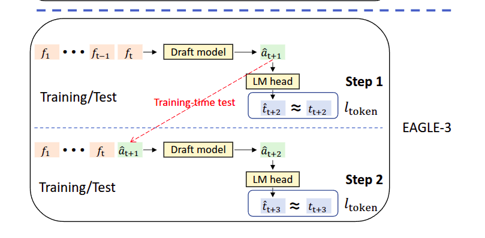
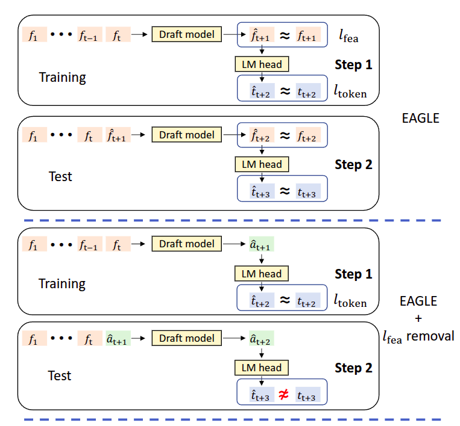
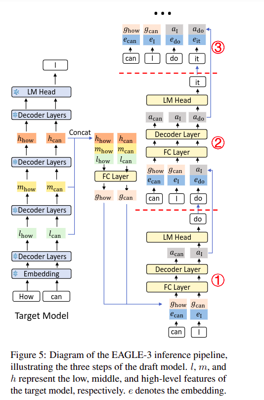

# Learning from EAGLE-3

Paper Link: [EAGLE-3](https://arxiv.org/pdf/2503.01840)

Imp Point:
> EAGLE performs autoregressive
> prediction at the feature level, predicting the next
> feature and then feeding the feature into the LM
> head of the target model to obtain the token distribution.

Another important point:
> EAGLE addresses this issue by feeding
> the token sequence from the previous time step, i.e.,
> the sampling results, into the draft model. Unlike
> the chain-like drafts of Vanilla speculative sampling, EAGLE generates multiple draft tokens at
> the same position, resulting in a tree-like draft. In
> the verification stage, EAGLE uses tree attention to
> parallelize the verification of the draft tree. Interestingly, EAGLE inspired the multi-token predictiontechnique used in the pre-training of DeepSeekv3

---
Paper to read : [<i><b>Tree Attention</b></i>](https://arxiv.org/pdf/2408.04093)

It's a long paper to read as of now, but will updated them for sure, notes for that particular paper: [<i><b>Tree Attention</b></i>](./tree_attention.md) 

---

This is basically what they are trying to do, as in Medusa, they are predicting the tokens using the feature before the lm head, and feeding to a draft model, to get the ouput. Before this thing they dint think of the predicted token can be used as the next feature appending the tokens predicted before this.

## Inference Pipeline:

So the steps as far as i understood over here is that:

### Setup Phase
- EAGLE-3 alternates between drafting (generating candidate tokens) and verification (checking if they're correct)
- The key innovation is in how the drafting stage captures and reuses information from the target model

### Feature Extraction Process
- During the target model's forward pass, EAGLE-3 captures features from three different layers:
  - Low-level features (l)
  - Middle-level features (m)
  - High-level features (h)
- These k-dimensional vectors are concatenated into a 3k-dimensional vector
- A fully connected layer compresses this back to k-dimensions, creating an integrated feature g

### Draft Token Generation
#### Step 1: Initial Draft
- Input: "How can" → Target model generates "I"
- Process: Use stored features g_how and g_can, plus embedding of sampled token "I"
- Output: Draft model generates "do"
- Key: The draft model gets both the target model's internal features AND the actual sampled token

#### Step 2: Subsequent Drafts
- Challenge: For "How can I", we need g_I but the target model hasn't processed "I" yet
- Solution: Replace missing g_I with a_I (the draft model's output from Step 1)
- Process: Concatenate a_I with embedding of "do" to generate next draft token

#### Step 3 and Beyond
- Pattern: Continue using draft model outputs (a_do, a_it, etc.) as replacements for missing target model features
- Input: Previous draft output + current token embedding → Next draft token

---
### Motivation

Read this paper as SGLang uses this, and i just wanna use this for my idea, as well.

---